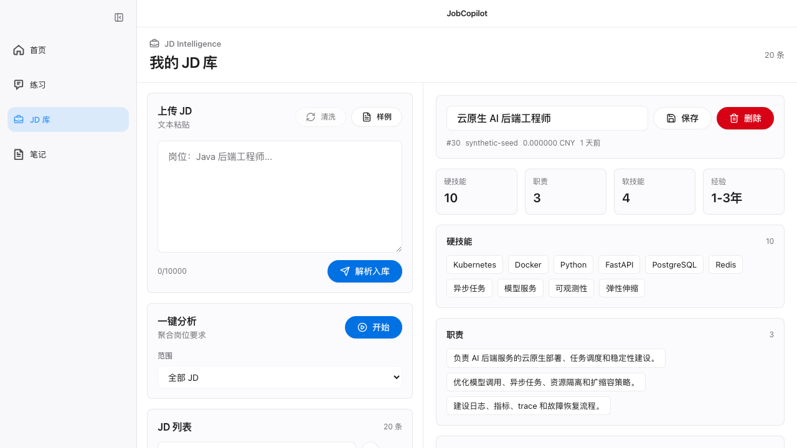
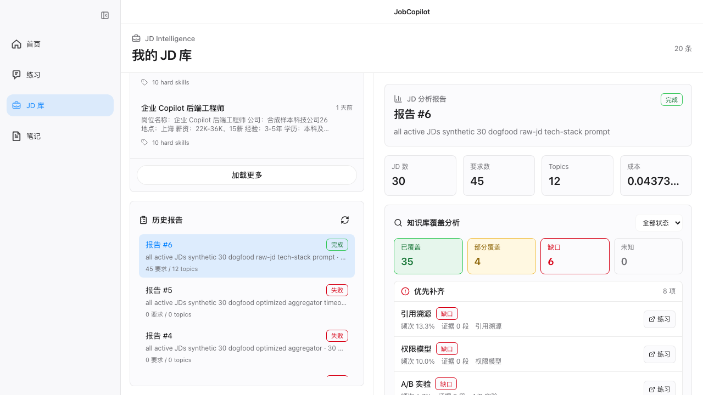
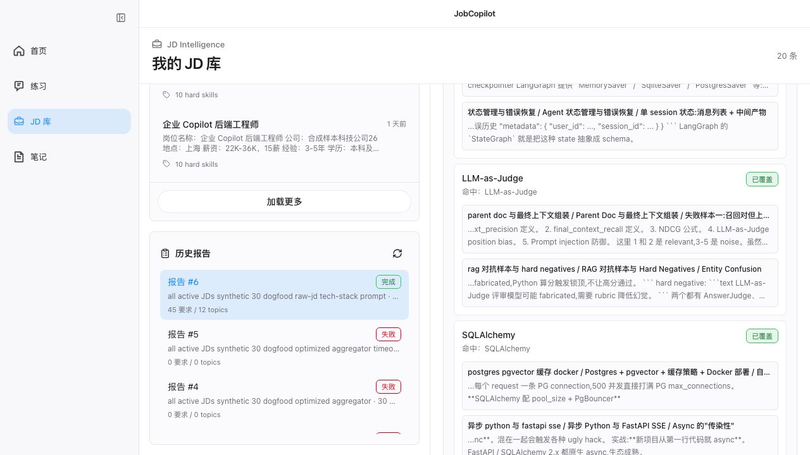
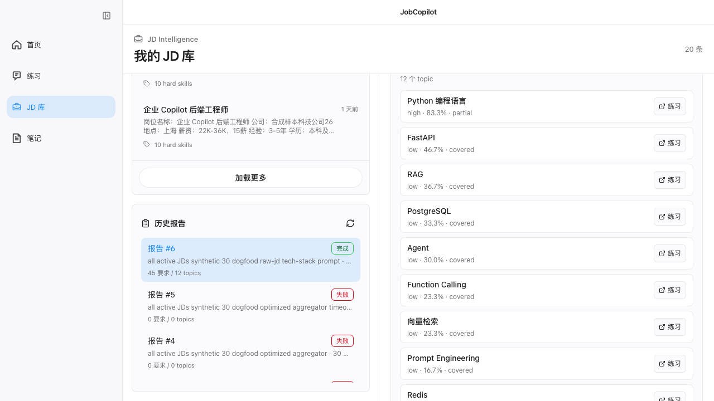
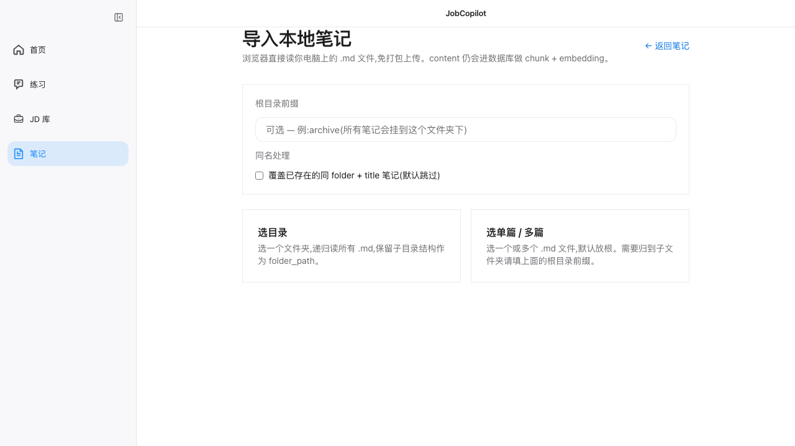
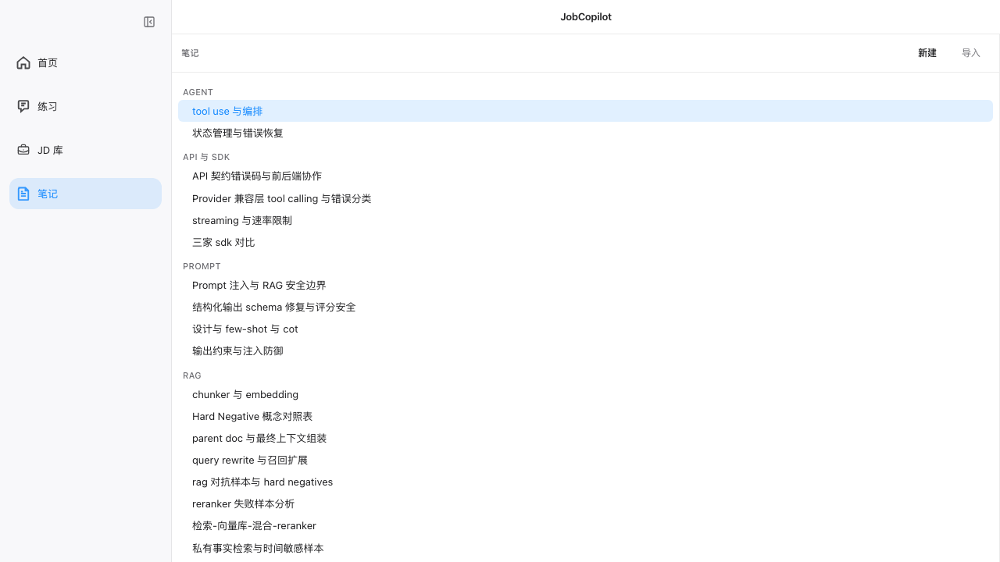
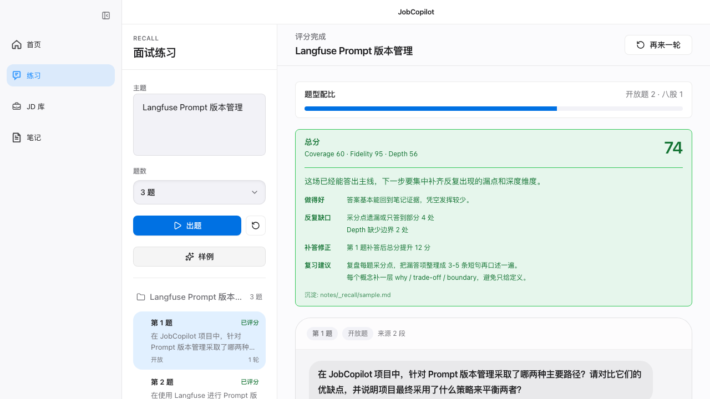
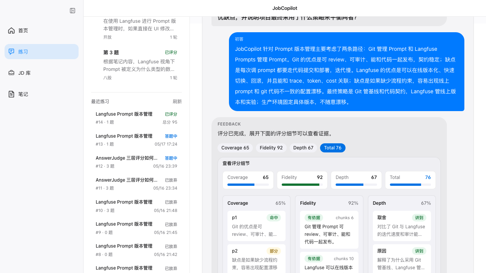

# JobCopilot

> 本地优先的 AI 求职准备工作台:把目标岗位 JD 累积成岗位要求地图和学习路径,再用自己的 Markdown 笔记做 RAG 面试陪练。

[](docs/7-ROADMAP.md)
[](LICENSE)
[](#技术栈)
[](#配置)

[演示截图](#演示截图) | [快速开始](#快速开始) | [文档导航](#文档导航) | [English Summary](#english-summary)

---

## 目录

- [概览](#概览)
- [演示截图](#演示截图)
- [为什么做 JobCopilot](#为什么做-jobcopilot)
- [功能特性](#功能特性)
- [快速开始](#快速开始)
- [配置](#配置)
- [使用方式](#使用方式)
- [API Surface](#api-surface)
- [架构](#架构)
- [技术栈](#技术栈)
- [项目结构](#项目结构)
- [本地开发](#本地开发)
- [测试与评测](#测试与评测)
- [路线图](#路线图)
- [限制与非目标](#限制与非目标)
- [文档导航](#文档导航)
- [贡献](#贡献)
- [许可证](#许可证)
- [English Summary](#english-summary)

## 概览

JobCopilot 面向正在准备软件工程岗位的计算机学习者和开发者,核心是两条相连的工作流:

1. **JD Intelligence**:把陆续收集的目标岗位 JD 持久化到本地库,解析成结构化数据,聚合重复要求,重算频次,生成学习路径和 quiz topic 候选。
2. **笔记 RAG 面试陪练**:导入 Markdown 笔记,只从相关笔记 chunks 里检索上下文,生成面试题,用 evidence 评分,并支持多轮补答和追问教练。

项目目前是单用户、本地 dogfood 优先形态。你的笔记、JD、报告、练习 session 和 recall 文件默认保存在本机工作区和 Postgres 数据库里。LLM 调用通过你自己的 DashScope/Qwen API Key 完成。

## 演示截图

以下截图来自本地 dogfood 数据,覆盖当前前端的主要功能面。

### 1. JD 入库与结构化详情

文本 JD 粘贴后立即解析入库,右侧展示结构化字段、技能、职责和成本审计。



### 2. JD 覆盖分析与优先补齐

30 条 JD dogfood 报告会沉淀知识库 covered / partial / missing 覆盖矩阵,并把最该补的缺口排到前面。



### 3. 岗位要求证据矩阵

每个聚合后的岗位要求会保留命中短语、证据片段和 covered / partial / missing 状态。



### 4. 学习路径与 Quiz Topics

报告产出的 topic 可直接跳到 `/quiz`,把 JD 缺口转成下一轮面试练习。



### 5. 本地笔记导入

浏览器直接读取本机 Markdown 目录或多文件,导入后进入 chunk + embedding 流程。



### 6. Markdown 笔记库

本地 Markdown 笔记按 folder / heading 组织,作为出题、评分和覆盖分析的私有知识来源。



### 7. RAG 面试练习总结

从主题 query 进入出题、答题、evidence-bound 评分、多轮补答纠偏和整场总结。



### 8. 评分证据与多轮反馈

评分细节展开后可以看到 Coverage、Fidelity、Depth 的证据卡片和追问/补答上下文。



## 为什么做 JobCopilot

普通 LLM 官网已经能完成一次性面试问答。JobCopilot 聚焦的是单个聊天窗口很难长期承载的工作流:

- **JD 研究是累积型资产**:真实求职周期里会持续收集几十条同类 JD,而不是一次性粘贴完。
- **频次和证据比单次回答更重要**:用户真正需要的是要求地图、学习优先级、证据 JD 和可回看的报告。
- **面试练习必须贴着自己的笔记**:题目和评分应锚定用户写过的 Markdown,避免模型凭训练数据自由发挥。
- **多轮纠偏需要状态**:初答、补答、教练解释、分数、缺口和总结都需要刷新后可恢复、可回放。

## 功能特性

### JD Intelligence

| 功能 | 当前状态 |
|------|----------|
| JD 库 | 支持文本粘贴上传 JD,立即调用 `jd_parser` 解析,并支持列表、详情、筛选、title 修改和软删 |
| JD 一键分析 | `POST /api/jd-analyses` 通过 SSE 跑报告流程:读取 parsed payload、聚合要求、同义去重、Python 重算频次、生成学习路径和 quiz topics |
| 历史报告 | 保存 `jd_analyses` 快照,包含岗位要求地图、证据 JD ids、token/cost 审计和知识库覆盖矩阵 |
| Topic 跳转 | 报告里的 quiz topic 候选可作为普通 `/quiz` 主题 query 进入面试练习 |
| JD 输入边界 | 当前只支持文本 JD;截图 OCR 已从 M2.5 范围移除 |

### 面试教练

| 功能 | 当前状态 |
|------|----------|
| Markdown 笔记入库 | 浏览器读取本地 Markdown,后端按 folder 和 heading 切 chunk,写入 Postgres |
| Retrieval pipeline | query rewrite、hybrid search、RRF、provider rerank、deterministic governance、0 命中守门 |
| 出题 | `QuizGenerator` 基于选出的 chunks 生成 source-grounded questions |
| 评分 | `AnswerJudge` 返回 Coverage、Fidelity、Depth evidence,总分由 Python 计算 |
| 多轮纠偏 | 初答和补答会进入评分;追问教练只解释反馈,不改答案、不重评 |
| Session 沉淀 | 完成后可写入 `_recall/{session_id}.md` 复习总结 |

### 工程能力

| 功能 | 当前状态 |
|------|----------|
| 本地优先 | Docker Compose 启动 Postgres、API、Web、Caddy 和可选 Langfuse |
| 流式体验 | 出题、评分、整场总结、JD 一键分析等长流程走 SSE |
| 可观测 | 记录 `trace_id`、LLM calls、token/cost、cache metadata,可选接 Langfuse |
| 手动闸门 | 测试、lint、typecheck、build、eval runner 保留命令入口,但 push 不自动触发 |

## 快速开始

### 前置条件

- Docker with Compose v2
- DashScope API Key: [阿里云百炼控制台](https://bailian.console.aliyun.com/)

### 使用 Docker Compose 启动

```bash
git clone https://github.com/lemma42796/job-copilot.git
cd job-copilot
cp .env.example .env
```

编辑 `.env`:

```bash
DASHSCOPE_API_KEY=sk-your-key
LLM_PROVIDER=dashscope
JOBCOPILOT_ENV=dev
```

启动:

```bash
docker compose up -d
```

访问:

```text
Web app:  http://localhost:3000
API:      http://localhost:8000/v1/health
API docs: http://localhost:8000/v1/docs
Langfuse: http://localhost:3001
Caddy:    http://localhost
```

## 配置

| 变量 | 必填 | 说明 |
|------|------|------|
| `DASHSCOPE_API_KEY` | 是 | DashScope/Qwen API Key;Docker 会映射为 `JOBCOPILOT_DASHSCOPE_API_KEY` |
| `LLM_PROVIDER` | 否 | 默认 `dashscope`;模板里保留 `deepseek` 备选 |
| `JOBCOPILOT_ENV` | 否 | `dev`、`prod` 或 `test`;默认 `dev` |
| `JOBCOPILOT_NOTES_FS_ROOT` | 否 | 本地 notes/recall 根目录;dev 未设置时优先使用 `test-notes/llm-notes` |
| `LANGFUSE_PUBLIC_KEY` | 否 | 可选 Langfuse public key;留空时 SDK noop |
| `LANGFUSE_SECRET_KEY` | 否 | 可选 Langfuse secret key |
| `LANGFUSE_HOST` | 否 | 可选 Langfuse host;Compose 容器内默认 `http://langfuse:3000` |

## 使用方式

### 分析岗位 JD

1. 打开 `http://localhost:3000/jds`。
2. 粘贴一条 JD,后端会立即解析并保存结构化结果。
3. 持续上传同类岗位 JD。
4. 选择分析范围:全部、最近 N 条、指定 ids 或 title 筛选。
5. 点击一键分析。
6. 查看岗位要求地图、学习路径、知识库覆盖矩阵和 quiz topic 候选。

### 用笔记练面试

1. 打开 `http://localhost:3000/notes`。
2. 导入或编写 Markdown 笔记。
3. 打开 `http://localhost:3000/quiz`。
4. 输入一个主题 query,或从 JD 报告 topic 跳转过来。
5. 一次回答一道题。
6. 答得不完整时用补答继续评分;看不懂反馈时追问教练。
7. 完成 session 后生成 recall 总结。

## API Surface

| Endpoint | 用途 |
|----------|------|
| `GET /v1/health` | 服务健康检查 |
| `POST /api/notes/batch-import` | 导入浏览器读取到的 Markdown 笔记 |
| `GET /api/notes/tree` | 读取笔记树 |
| `POST /api/quiz/sessions` | 通过 SSE 创建主题类 RAG 练习 session |
| `GET /api/quiz/sessions/{id}` | 恢复 quiz session 并回放状态 |
| `POST /api/quiz/sessions/{id}/answers/{order_index}/turns` | 通过 SSE 提交初答、补答或追问教练 |
| `POST /api/quiz/sessions/{id}/finish` | 通过 SSE 生成整场总结 |
| `POST /api/jds` | 上传并解析文本 JD |
| `GET /api/jds` | 列出已保存 JD |
| `POST /api/jd-analyses` | 通过 SSE 运行 JD 一键分析 |
| `GET /api/jd-analyses/{id}` | 读取已保存的 JD 分析报告 |

完整请求/响应契约见 [`docs/4-API_SPEC.md`](docs/4-API_SPEC.md)。

## 架构

```text
apps/web (Next.js 15 / React 19)
  notes, quiz, jds UI
  SSE client
  macOS-style app shell
        |
        | REST + SSE
        v
apps/api (FastAPI / SQLAlchemy 2.x async)
  routers:  notes, quiz, jd, health
  services: retrieval, quiz, answer, interview, jd, recall
  agents:   quiz_generator, answer_judge, jd_parser, jd_aggregator, coach_chat
  llm:      provider abstraction, cache, pricing, logging
  infra:    Postgres, pgvector, Langfuse, request id
        |
        v
Postgres 16 + pgvector
  notes / note_chunks / questions / quiz_sessions / session_answers
  session_events / jds / jd_analyses / llm_response_cache / llm_calls
        |
        v
DashScope / Qwen
  generation, embedding, rerank
```

## 技术栈

| 层 | 技术 |
|----|------|
| Frontend | Next.js 15, React 19, TypeScript, Tailwind CSS, lucide-react |
| Backend | FastAPI, Pydantic v2, SQLAlchemy 2.x async, sse-starlette |
| Database | Postgres 16, pgvector, Alembic |
| LLM | DashScope/Qwen, OpenAI-compatible SDK, structured output, prompt cache |
| Retrieval | pgvector, tsvector, RRF, query rewrite, provider rerank, deterministic governance |
| Observability | request id, `llm_calls`, token/cost audit, optional Langfuse v2 |
| Tooling | Docker Compose, uv, pnpm, Biome, ruff, mypy, pytest |

## 项目结构

```text
apps/
  api/              FastAPI backend, agents, services, models, migrations
  web/              Next.js frontend
packages/
  schemas/          shared TypeScript schemas
docs/               产品、技术、API、Agent、评测、路线图文档
evals/              evaluation datasets and reports
docker/             Dockerfiles and service config
test-notes/         local dogfood notes and recall output
```

## 本地开发

安装依赖:

```bash
pnpm install
uv sync
```

本机启动前后端:

```bash
pnpm --filter @jobcopilot/web dev
uv run uvicorn jobcopilot_api.main:app --reload --app-dir apps/api/src --port 8000
```

日常开发推荐使用 Docker Postgres + 本机 API/Web 进程。完整 Docker Compose 更适合干净的一体化启动。

## 测试与评测

仓库保留验证命令,但默认由维护者手动运行。push 不自动触发测试、typecheck、lint、build 或 eval jobs。

常用手动闸门:

```bash
uv run pytest -q
uv run ruff check apps/api
uv run mypy apps/api/src
pnpm typecheck
pnpm build
```

评测设计见 [`docs/6-EVAL_PLAN.md`](docs/6-EVAL_PLAN.md)。M2.5 JD 报告质量当前走手动 dogfood,不新增 `jd_aggregator` 自动化评测主线。

## 路线图

```text
M0    仓库改造 + v2 文档重写                                  done
M1    Markdown 笔记入库 + chunking + 树形导航 + Langfuse 起步   done
M2    主题 query -> RAG -> 出题 -> LLM-as-Judge                 done
M2.1  InterviewCoachAgent 状态机 + 多轮纠偏                    done
M2.5  JD Intelligence Agent + 知识库覆盖分析                   closeout
```

后续不再规划 SR、弱点 dashboard、岗位类三源出题、简历上传、简历诊断或简历改写。持续生产力主线收束到 JD Intelligence。

## 限制与非目标

- 单用户本地 dogfood 项目,暂无 auth 或 SaaS 模式。
- 当前 JD 上传以文本粘贴为主;截图 OCR 已明确移出 M2.5 范围。
- JD 聚合不是 RAG pipeline。它是对选定 parsed JDs 的有界归纳统计;RAG 只在 topic 进入 `/quiz` 后发生。
- 项目明确不做简历生成、简历定制、投递追踪。
- 自动化验证不会在每次 push 时运行,需要维护者按需手动跑。

## 文档导航

| 文档 | 用途 |
|------|------|
| [`docs/STATUS.md`](docs/STATUS.md) | 当前短接力页和已锁定决策 |
| [`docs/1-PRD.md`](docs/1-PRD.md) | 产品定位、用户故事、范围边界 |
| [`docs/2-TECH_DESIGN.md`](docs/2-TECH_DESIGN.md) | 架构、模块边界、数据流、可观测 |
| [`docs/3-DATA_MODEL.md`](docs/3-DATA_MODEL.md) | 表结构、JSONB schema、迁移边界 |
| [`docs/4-API_SPEC.md`](docs/4-API_SPEC.md) | REST 和 SSE API 契约 |
| [`docs/5-AGENT_DESIGN.md`](docs/5-AGENT_DESIGN.md) | Agent prompt、输出契约、M2.1/M2.5 编排 |
| [`docs/6-EVAL_PLAN.md`](docs/6-EVAL_PLAN.md) | 评测套件与手动 dogfood 口径 |
| [`docs/7-ROADMAP.md`](docs/7-ROADMAP.md) | 里程碑、退出标准、非目标 |
| [`docs/8-ENGINEERING.md`](docs/8-ENGINEERING.md) | 工程规范、本地开发、CI 策略 |
| [`docs/9-LESSONS.md`](docs/9-LESSONS.md) | v1/v2 踩坑与产品反思 |

## 贡献

欢迎 issue 和聚焦的 pull request。比较适合的贡献类型:

- README、文档、onboarding 改进。
- 有清晰复现路径的 bug fix。
- 不扩大产品边界的 M2.5 JD Intelligence 改进。
- 让手动验证路径更清楚的开发体验改进。

请保持改动聚焦,并说明你做过哪些手动验证。

## 许可证

[MIT](LICENSE)

## 致谢

- 阿里云百炼 / DashScope / Qwen
- LangGraph、FastAPI、Next.js、pgvector、SQLAlchemy、Tailwind CSS、Langfuse 和开源社区

---

## English Summary

JobCopilot is a local-first AI job-preparation workspace for CS learners and developers.

It helps you collect job descriptions over time, turn them into requirement maps, knowledge-coverage matrices, and learning paths, then practice those topics with a note-grounded RAG interview coach.

The core workflow is implemented and currently in closeout/dogfood mode. The project is intentionally single-user and local-first, with manual validation gates and a clear non-goal list around resume generation, application tracking, SR dashboards, and SaaS expansion.
